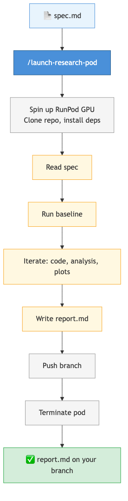

# Zombuul

Autonomous research loops on GPU pods with Claude Code. Write an experiment spec, launch it, come back to a report.

## What it does

You write a markdown spec describing a research question. Claude Code runs the experiment autonomously on a RunPod GPU — baseline, iterations, plots, report. When it finishes, the pod terminates. Optionally, ralph mode chains experiments: each report feeds into the next, building a sequence of experiments that converge on an answer.



## Commands

| Command | What it does |
|---------|-------------|
| `/launch-research-loop` | Run one experiment autonomously from spec to pushed report |
| `/launch-research-ralph` | Ralph mode — chain experiments, each building on the last, until the goal is met |
| `/review-experiment-report` | Rewrite a report for clarity (subagent, no code context) |
| `/launch-research-pod` | Spin up a GPU pod and launch a research loop on it |
| `/launch-runpod` | Spin up a GPU pod interactively |
| `/stop-runpod` | List and terminate pods |

## Context management

The main challenge with long-running autonomous agents is context pollution. Zombuul addresses this at several levels:

- **Plotting** delegated to subagents (matplotlib code never enters main context)
- **Report review** delegated to a subagent that only sees spec + report (no code)
- **Running log** is write-only during session (recovery mechanism, never re-read)
- **Ralph synthesis**: older reports summarized by subagent, only latest report read in full

## Directory layout

All commands and scripts live in this repo:

```
zombuul/
├── .claude-plugin/plugin.json
├── commands/
│   ├── launch-research-loop.md
│   ├── launch-research-ralph.md
│   ├── review-experiment-report.md
│   ├── launch-research-pod.md
│   ├── launch-runpod.md
│   └── stop-runpod.md
├── scripts/
│   ├── runpod_ctl.py       # RunPod API wrapper (create, list, stop, SSH)
│   └── pod_setup.sh        # pod bootstrap (clone, deps, claude, auth)
└── architecture.png
```

Zombuul is a Claude Code plugin. Install it, and commands are available globally.

## Setup

### Prerequisites

- `pip install runpod` locally (for the RunPod API client)
- Your repo has a `pyproject.toml` (the pod runs `uv pip install -e .`)
- SSH key at `~/.ssh/id_ed25519`
- RUNPOD_API_KEY in `~/.claude/.env`

### Create a `.env` in your repo root

```
GH_TOKEN=<github pat>
HF_TOKEN=<huggingface token>       # optional
GIT_USER_NAME=Your Name
GIT_USER_EMAIL=you@example.com
```

This gets SCP'd to the pod during setup. The pod setup script reads git identity and tokens from it.

### For ralph mode (optional)

Install the ralph-wiggum plugin from `anthropics/claude-code`:

```
/plugin marketplace add anthropics/claude-code
/plugin    # → Discover → ralph-loop → Install
```

## Launch

```
/launch-research-pod experiments/my_question/spec.md
```

The plugin:
1. Infers the repo URL from `git remote get-url origin`
2. Spins up a pod, clones the repo, installs deps via `uv pip install -e .`
3. Copies `.env` and Claude Code credentials to the pod
4. Launches the research loop in sandboxed mode (`IS_SANDBOX=1`) headlessly in tmux
5. Pod auto-terminates when done

## Customization

- **Experiment specs**: freeform markdown in `experiments/`. Include background, methods, success criteria, code to reuse.
- **Project rules**: add constraints to your CLAUDE.md (e.g., "always use PyTorch", "don't modify src/"). They apply automatically inside the research loop.
- **Extra Python deps**: add to `pyproject.toml` — the pod runs `uv pip install -e .` which picks them up.
